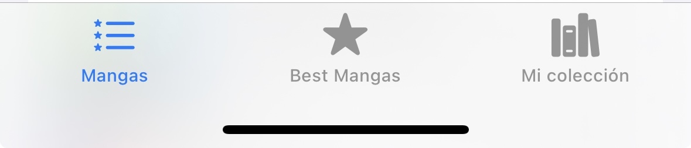
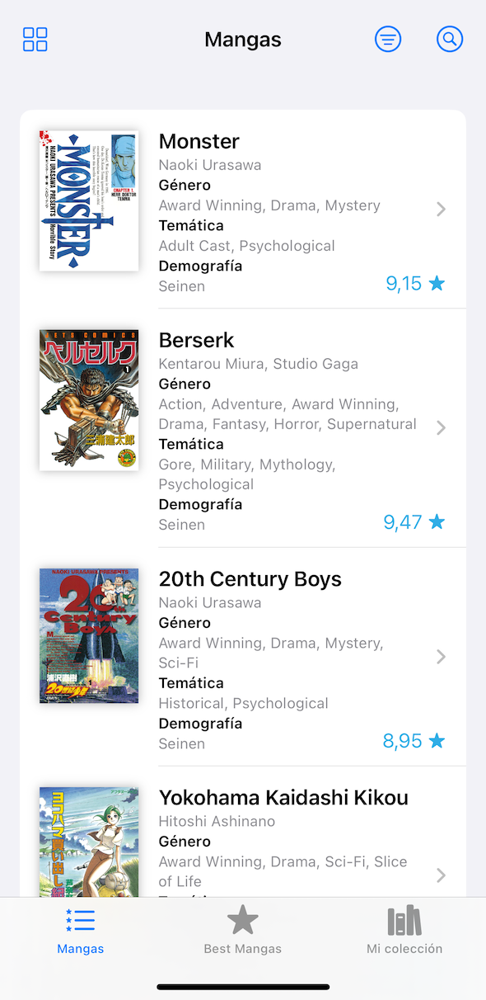
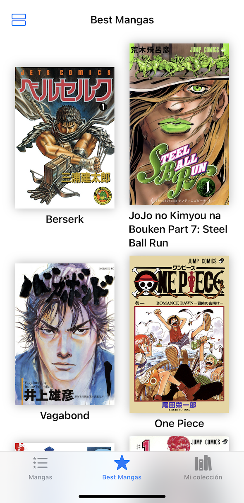
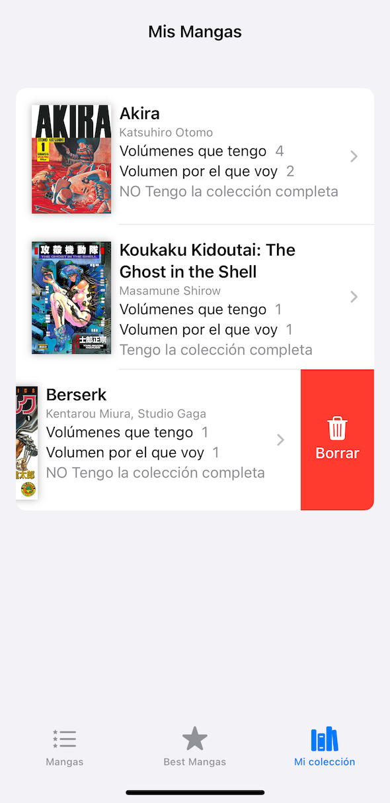
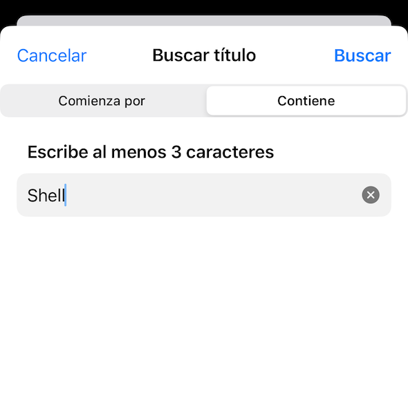
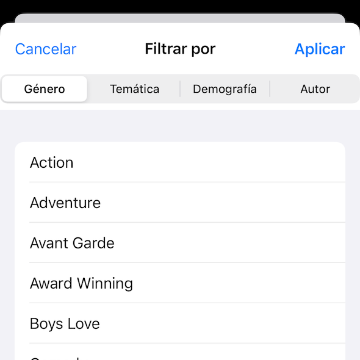
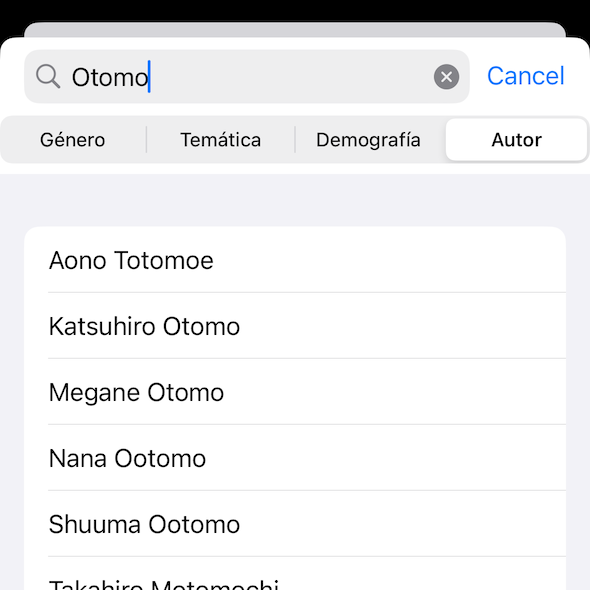

# ZMangas
App para **iPhone** y **iPad** que permite consultar referencias bibiográficas de **mangas** y guardar los **favoritos** del usuario. Los **datos que guarda** sobre cada título son:
* Número de volúmenes comprados.
* Volumen que actualmente está leyendo el usuario.
* Si tiene la colección completa.

Consta de un `TabView` con **3 pestañas**:

  

1. **Mangas**: muestra el listado de mangas que puede _filtrarse_ por **Género**, **Temática**, **Demografía** o **Autor**. Independientemente, puede realizarse la _búsqueda_ por **Título**: que contenga o comienze por una cadena que el usuario escriba.
2. **Best Mangas**: visualiza los títulos ordenados empezando por los de mayor puntuación.
3. **Mi colección**: muestra los mangas que el usuario guarda en su coleccción.

Todas las pestañas permiten navegar al **detalle** del manga.

En las pestañas **Mangas** y **Best Mangas** los mangas pueden visualizarse en modo _listado_ y _grid_ (cuadrícula).

Utiliza un paginado de 50 items por página.

En iPad tiene un funcionamiento similar, salvo que las opciones del _TabView_ están en la _SideBar_.

## Uso
* Para **añadir** un manga a su colección, presiónelo hasta que aparezca el _menu  contextual_ y presione _Añadir a mi colección_. Si ya está en su colección aparecerá un mensaje indicándolo.
* Para **actualizar** los datos sobre un manga guardado, navegue al detalle del manga en _Mi colección_ y modifique los datos.
* Para **borrar** un manga de su colección, navegue a _Mi colección_, busque el manga que desea eliminar y elimínelo deslizándolo hacia la izquierda.
* Para **deshacer** una _búsqueda_ o un _filtrado_ deslize el listado hacia abajo cuando esté visualizando el principio de éste (haga un _pull-to-refresh_).

  
  
  

  
  
  

